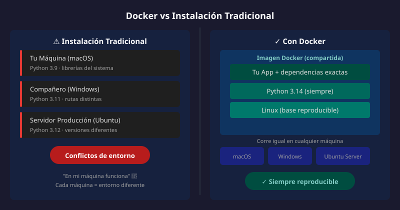

# 🐳 Entorno de Desarrollo con Docker

## 🎯 Objetivos

- Entender por qué usamos Docker en el bootcamp
- Conocer la estructura básica de Docker y Docker Compose
- Configurar tu primer proyecto FastAPI con Docker

---

## 📋 Contenido

### 1. ¿Por qué Docker?

En desarrollo de software, uno de los problemas más comunes es:

> "En mi máquina funciona" 🤷

Docker resuelve este problema creando **contenedores**: entornos aislados y reproducibles.



#### Beneficios para el Bootcamp

| Sin Docker | Con Docker |
|------------|------------|
| Instalar Python 3.13 manualmente | Python incluido en el contenedor |
| Conflictos entre versiones | Cada proyecto aislado |
| "En mi máquina funciona" | Funciona igual en todos lados |
| Configuración manual del entorno | Un comando: `docker compose up` |

---

### 2. Conceptos Clave

#### Container (Contenedor)

Un contenedor es como una "caja" que contiene:
- Tu código
- Python y sus dependencias
- Configuración del entorno

```
┌─────────────────────────────┐
│       CONTENEDOR            │
│  ┌───────────────────────┐  │
│  │   Tu código FastAPI   │  │
│  ├───────────────────────┤  │
│  │   Python 3.13 + uv    │  │
│  ├───────────────────────┤  │
│  │   FastAPI, Uvicorn    │  │
│  └───────────────────────┘  │
└─────────────────────────────┘
```

#### Image (Imagen)

La imagen es la **plantilla** para crear contenedores. Se define en un `Dockerfile`.

#### Docker Compose

Herramienta para orquestar múltiples contenedores (API, base de datos, etc.).

---

### 3. Estructura de Archivos

Todo proyecto del bootcamp tendrá estos archivos:

```
proyecto/
├── docker-compose.yml    # Orquestación de servicios
├── Dockerfile            # Cómo construir la imagen
├── .env.example          # Variables de entorno (template)
├── pyproject.toml        # Dependencias Python (uv)
└── src/
    └── main.py           # Código de la API
```

---

### 4. Dockerfile Explicado

```dockerfile
# Imagen base: Python 3.13 versión ligera
FROM python:3.13-slim

# Variables de entorno para Python
ENV PYTHONDONTWRITEBYTECODE=1 \
    PYTHONUNBUFFERED=1 \
    UV_SYSTEM_PYTHON=1

# Instalar uv (gestor de paquetes moderno)
RUN pip install --no-cache-dir uv

# Directorio de trabajo dentro del contenedor
WORKDIR /app

# Copiar archivos de dependencias
COPY pyproject.toml uv.lock* ./

# Instalar dependencias (sin las de desarrollo)
RUN uv sync --frozen --no-dev

# Copiar el código fuente
COPY . .

# Puerto que expone la API
EXPOSE 8000

# Comando para ejecutar la API
CMD ["uv", "run", "fastapi", "dev", "src/main.py", "--host", "0.0.0.0"]
```

#### Explicación línea por línea

| Línea | Propósito |
|-------|-----------|
| `FROM python:3.13-slim` | Usa Python 3.13 como base |
| `ENV PYTHONDONTWRITEBYTECODE=1` | No crear archivos `.pyc` |
| `ENV PYTHONUNBUFFERED=1` | Output directo (sin buffer) |
| `RUN pip install uv` | Instalar gestor de paquetes |
| `WORKDIR /app` | Todo se ejecuta desde `/app` |
| `COPY pyproject.toml` | Copiar lista de dependencias |
| `RUN uv sync` | Instalar dependencias |
| `EXPOSE 8000` | Documentar puerto usado |
| `CMD [...]` | Comando al iniciar contenedor |

---

### 5. Docker Compose Explicado

```yaml
services:
  api:
    build: .
    ports:
      - "8000:8000"
    volumes:
      - ./src:/app/src
    environment:
      - DEBUG=true
```

#### Explicación

| Campo | Propósito |
|-------|-----------|
| `services:` | Lista de contenedores |
| `api:` | Nombre del servicio |
| `build: .` | Construir desde Dockerfile local |
| `ports:` | Mapear puerto host:contenedor |
| `volumes:` | Sincronizar código (hot reload) |
| `environment:` | Variables de entorno |

---

### 6. Comandos Esenciales

```bash
# Construir y levantar (primera vez o cambios en Dockerfile)
docker compose up --build

# Levantar servicios (ya construidos)
docker compose up

# Levantar en segundo plano
docker compose up -d

# Ver logs en tiempo real
docker compose logs -f api

# Ejecutar comando dentro del contenedor
docker compose exec api bash

# Detener servicios
docker compose down

# Detener y eliminar volúmenes (reset completo)
docker compose down -v
```

---

### 7. Flujo de Trabajo

```
1. Escribir código en src/main.py
         ↓
2. Docker detecta cambios (volume mount)
         ↓
3. FastAPI recarga automáticamente (hot reload)
         ↓
4. Probar en http://localhost:8000/docs
```

> 💡 **Hot Reload**: Gracias al `volume` y FastAPI dev mode, los cambios se reflejan automáticamente sin reiniciar.

---

## ✅ Checklist de Verificación

Antes de continuar, asegúrate de:

- [ ] Entender qué es un contenedor y por qué lo usamos
- [ ] Conocer la diferencia entre imagen y contenedor
- [ ] Saber qué hace cada línea del Dockerfile
- [ ] Conocer los comandos básicos de docker compose
- [ ] Tener Docker instalado y funcionando ([Bootcamp Docker](https://github.com/ergrato-dev/bc-docker))

---

## 📚 Recursos Adicionales

- [Docker Documentation](https://docs.docker.com/)
- [Docker Compose Overview](https://docs.docker.com/compose/)
- [Guía de instalación del bootcamp](../../../docs/docker-setup.md)

---

## ➡️ Siguiente

[02 - Python Moderno](02-python-moderno.md)
