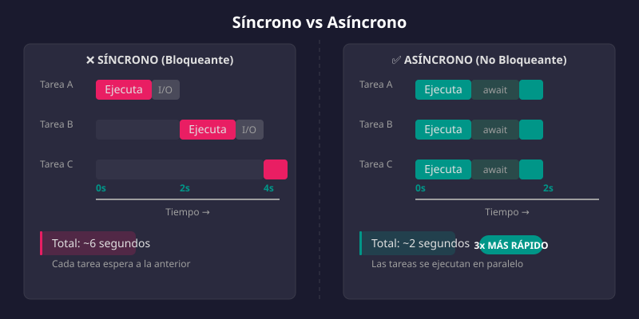
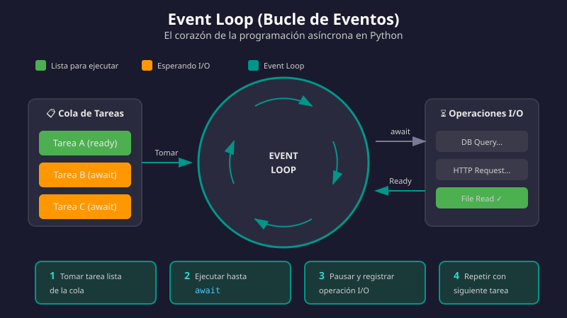

# 🔄 Programación Asíncrona en Python

## 🎯 Objetivos de Aprendizaje

Al finalizar este tema, serás capaz de:

- ✅ Entender la diferencia entre código síncrono y asíncrono
- ✅ Comprender el Event Loop y cómo funciona
- ✅ Usar `async` y `await` correctamente
- ✅ Crear y ejecutar coroutines
- ✅ Entender por qué FastAPI usa programación asíncrona

---

## 📚 Contenido

### 1. ¿Qué es la Programación Asíncrona?

La programación asíncrona permite que tu programa **continúe ejecutando otras tareas** mientras espera operaciones lentas (I/O), en lugar de quedarse bloqueado.



#### Analogía del Restaurante 🍽️

**Síncrono (un mesero, una mesa a la vez):**
```
1. Tomar pedido Mesa 1 → Esperar cocina → Servir Mesa 1
2. Tomar pedido Mesa 2 → Esperar cocina → Servir Mesa 2
3. Tomar pedido Mesa 3 → Esperar cocina → Servir Mesa 3
Tiempo total: 30 minutos
```

**Asíncrono (un mesero, múltiples mesas):**
```
1. Tomar pedido Mesa 1 → Enviar a cocina
2. Tomar pedido Mesa 2 → Enviar a cocina
3. Tomar pedido Mesa 3 → Enviar a cocina
4. Servir Mesa 1 (lista) → Servir Mesa 2 → Servir Mesa 3
Tiempo total: 12 minutos
```

#### Operaciones Bloqueantes (I/O)

Estas operaciones son **lentas** y el programa normalmente espera:

| Operación | Tiempo típico |
|-----------|---------------|
| Lectura de archivo | 1-10 ms |
| Query a base de datos | 5-100 ms |
| Request HTTP externo | 50-2000 ms |
| Operación de red | 10-500 ms |

Con async, mientras esperas una operación, puedes atender otras solicitudes.

---

### 2. Código Síncrono vs Asíncrono

#### ❌ Código Síncrono (Bloqueante)

```python
import time

def fetch_data_sync(url: str) -> str:
    """Simula una petición HTTP que tarda 2 segundos"""
    print(f"Iniciando petición a {url}...")
    time.sleep(2)  # Bloquea TODO el programa
    print(f"Petición completada: {url}")
    return f"Datos de {url}"

def main_sync():
    """Ejecuta 3 peticiones de forma síncrona"""
    start = time.time()
    
    # Cada petición espera a que termine la anterior
    result1 = fetch_data_sync("api.com/users")
    result2 = fetch_data_sync("api.com/posts")
    result3 = fetch_data_sync("api.com/comments")
    
    elapsed = time.time() - start
    print(f"Tiempo total: {elapsed:.2f}s")  # ~6 segundos

main_sync()
```

**Salida:**
```
Iniciando petición a api.com/users...
Petición completada: api.com/users
Iniciando petición a api.com/posts...
Petición completada: api.com/posts
Iniciando petición a api.com/comments...
Petición completada: api.com/comments
Tiempo total: 6.00s
```

#### ✅ Código Asíncrono (No Bloqueante)

```python
import asyncio

async def fetch_data_async(url: str) -> str:
    """Simula una petición HTTP asíncrona que tarda 2 segundos"""
    print(f"Iniciando petición a {url}...")
    await asyncio.sleep(2)  # NO bloquea, permite otras tareas
    print(f"Petición completada: {url}")
    return f"Datos de {url}"

async def main_async():
    """Ejecuta 3 peticiones de forma asíncrona (concurrente)"""
    start = asyncio.get_event_loop().time()
    
    # Todas las peticiones se ejecutan concurrentemente
    results = await asyncio.gather(
        fetch_data_async("api.com/users"),
        fetch_data_async("api.com/posts"),
        fetch_data_async("api.com/comments"),
    )
    
    elapsed = asyncio.get_event_loop().time() - start
    print(f"Tiempo total: {elapsed:.2f}s")  # ~2 segundos
    return results

# Ejecutar el código asíncrono
asyncio.run(main_async())
```

**Salida:**
```
Iniciando petición a api.com/users...
Iniciando petición a api.com/posts...
Iniciando petición a api.com/comments...
Petición completada: api.com/users
Petición completada: api.com/posts
Petición completada: api.com/comments
Tiempo total: 2.00s
```

> 💡 **¡3x más rápido!** Las tres peticiones se ejecutaron en paralelo.

---

### 3. El Event Loop (Bucle de Eventos)

El **Event Loop** es el corazón de la programación asíncrona. Es un bucle infinito que:

1. **Recibe tareas** (coroutines)
2. **Ejecuta** hasta encontrar un `await`
3. **Pausa** la tarea actual
4. **Ejecuta otras tareas** mientras espera
5. **Retoma** cuando la operación termina



#### Visualización del Event Loop

```
┌─────────────────────────────────────────────────────────┐
│                     EVENT LOOP                          │
├─────────────────────────────────────────────────────────┤
│                                                         │
│  t=0ms:  [Tarea1: ejecutando] [Tarea2: esperando]      │
│  t=1ms:  [Tarea1: await...]   [Tarea2: ejecutando]     │
│  t=2ms:  [Tarea1: esperando]  [Tarea2: await...]       │
│  t=3ms:  [Tarea1: ejecutando] [Tarea2: esperando]      │
│  t=4ms:  [Tarea1: DONE ✓]     [Tarea2: ejecutando]     │
│  t=5ms:                       [Tarea2: DONE ✓]         │
│                                                         │
└─────────────────────────────────────────────────────────┘
```

#### Cómo Funciona Internamente

```python
import asyncio

async def task_example(name: str, delay: float) -> str:
    print(f"[{name}] Iniciando...")
    
    # await le dice al Event Loop: "Puedes ejecutar otras tareas"
    await asyncio.sleep(delay)
    
    print(f"[{name}] Completada después de {delay}s")
    return f"Resultado de {name}"

async def main():
    # Crear tareas (se registran en el Event Loop)
    task1 = asyncio.create_task(task_example("A", 2))
    task2 = asyncio.create_task(task_example("B", 1))
    task3 = asyncio.create_task(task_example("C", 3))
    
    # Esperar a que todas terminen
    results = await asyncio.gather(task1, task2, task3)
    print(f"Resultados: {results}")

asyncio.run(main())
```

**Salida (nota el orden):**
```
[A] Iniciando...
[B] Iniciando...
[C] Iniciando...
[B] Completada después de 1s    ← B termina primero
[A] Completada después de 2s    ← A termina segundo
[C] Completada después de 3s    ← C termina último
Resultados: ['Resultado de A', 'Resultado de B', 'Resultado de C']
```

---

### 4. Sintaxis: `async` y `await`

#### `async def` - Definir Coroutines

La palabra clave `async` convierte una función en una **coroutine**:

```python
# Función normal
def saludo_sync() -> str:
    return "Hola"

# Coroutine (función asíncrona)
async def saludo_async() -> str:
    return "Hola"

# Diferencia al llamarlas
print(saludo_sync())        # "Hola" (se ejecuta inmediatamente)
print(saludo_async())       # <coroutine object> (NO se ejecuta)

# Para ejecutar una coroutine necesitas await o asyncio.run()
async def main():
    result = await saludo_async()  # Ahora sí se ejecuta
    print(result)  # "Hola"

asyncio.run(main())
```

#### `await` - Esperar Resultados

`await` pausa la coroutine actual hasta que la operación termine:

```python
async def get_user(user_id: int) -> dict:
    """Simula obtener un usuario de la base de datos"""
    await asyncio.sleep(0.1)  # Simula query a DB
    return {"id": user_id, "name": f"User {user_id}"}

async def get_user_posts(user_id: int) -> list[dict]:
    """Simula obtener los posts de un usuario"""
    await asyncio.sleep(0.1)  # Simula query a DB
    return [
        {"id": 1, "title": "Post 1", "user_id": user_id},
        {"id": 2, "title": "Post 2", "user_id": user_id},
    ]

async def get_user_profile(user_id: int) -> dict:
    """Obtiene el perfil completo del usuario"""
    # Ejecutar ambas queries en paralelo
    user, posts = await asyncio.gather(
        get_user(user_id),
        get_user_posts(user_id),
    )
    
    return {
        "user": user,
        "posts": posts,
        "post_count": len(posts),
    }

# Uso
async def main():
    profile = await get_user_profile(123)
    print(profile)

asyncio.run(main())
```

---

### 5. Reglas Importantes

#### ⚠️ Solo puedes usar `await` dentro de `async def`

```python
# ❌ ERROR: await fuera de async
def bad_function():
    result = await some_async_function()  # SyntaxError!

# ✅ CORRECTO: await dentro de async
async def good_function():
    result = await some_async_function()
```

#### ⚠️ No mezcles sync y async sin cuidado

```python
import time

# ❌ MAL: time.sleep() bloquea TODO el Event Loop
async def bad_example():
    time.sleep(5)  # Bloquea todas las tareas async
    return "Done"

# ✅ BIEN: asyncio.sleep() permite concurrencia
async def good_example():
    await asyncio.sleep(5)  # Otras tareas pueden ejecutarse
    return "Done"
```

#### ⚠️ Las coroutines deben ser "awaited"

```python
async def fetch_data():
    return "data"

async def main():
    # ❌ MAL: No se ejecuta, solo crea el objeto coroutine
    fetch_data()  # Warning: coroutine was never awaited
    
    # ✅ BIEN: Usar await
    result = await fetch_data()
    
    # ✅ BIEN: Crear task para ejecutar después
    task = asyncio.create_task(fetch_data())
    result = await task
```

---

### 6. Patrones Comunes

#### Ejecutar Múltiples Tareas en Paralelo

```python
async def main():
    # asyncio.gather() - espera a que todas terminen
    results = await asyncio.gather(
        fetch_users(),
        fetch_posts(),
        fetch_comments(),
    )
    users, posts, comments = results
```

#### Ejecutar con Timeout

```python
async def main():
    try:
        # Timeout de 5 segundos
        result = await asyncio.wait_for(
            slow_operation(),
            timeout=5.0
        )
    except asyncio.TimeoutError:
        print("La operación tardó demasiado")
```

#### Ejecutar Primera que Complete

```python
async def main():
    # Retorna cuando la primera tarea termina
    done, pending = await asyncio.wait(
        [task1, task2, task3],
        return_when=asyncio.FIRST_COMPLETED
    )
    
    # Cancelar las pendientes
    for task in pending:
        task.cancel()
```

---

### 7. Async en FastAPI

FastAPI está diseñado para aprovechar la programación asíncrona:

```python
from fastapi import FastAPI
import httpx

app = FastAPI()

# ✅ Endpoint asíncrono - puede manejar muchas requests concurrentemente
@app.get("/users/{user_id}")
async def get_user(user_id: int):
    async with httpx.AsyncClient() as client:
        # Mientras espera la respuesta, puede atender otras requests
        response = await client.get(f"https://api.example.com/users/{user_id}")
        return response.json()

# ✅ También puedes usar funciones síncronas si no hay I/O
@app.get("/health")
def health_check():
    return {"status": "ok"}
```

> 💡 **FastAPI ejecuta funciones `def` en un thread pool**, así que ambas funcionan bien. Pero `async def` es más eficiente para operaciones I/O.

---

## 📝 Resumen

| Concepto | Descripción |
|----------|-------------|
| `async def` | Define una coroutine (función asíncrona) |
| `await` | Pausa y espera el resultado de una coroutine |
| Event Loop | Gestiona la ejecución de múltiples coroutines |
| `asyncio.gather()` | Ejecuta múltiples coroutines en paralelo |
| `asyncio.run()` | Punto de entrada para código async |
| Concurrencia | Múltiples tareas progresando, no necesariamente en paralelo |

---

## ✅ Checklist de Verificación

Antes de continuar, asegúrate de poder:

- [ ] Explicar la diferencia entre código síncrono y asíncrono
- [ ] Entender qué hace el Event Loop
- [ ] Escribir funciones con `async def`
- [ ] Usar `await` correctamente
- [ ] Ejecutar múltiples tareas con `asyncio.gather()`
- [ ] Entender por qué FastAPI usa async

---

## 🔗 Recursos Adicionales

- [Python asyncio Documentation](https://docs.python.org/3/library/asyncio.html)
- [Real Python: Async IO in Python](https://realpython.com/async-io-python/)
- [FastAPI: Async](https://fastapi.tiangolo.com/async/)

---

[← Anterior: Type Hints](03-type-hints.md) | [Siguiente: Introducción a FastAPI →](05-intro-fastapi.md)
