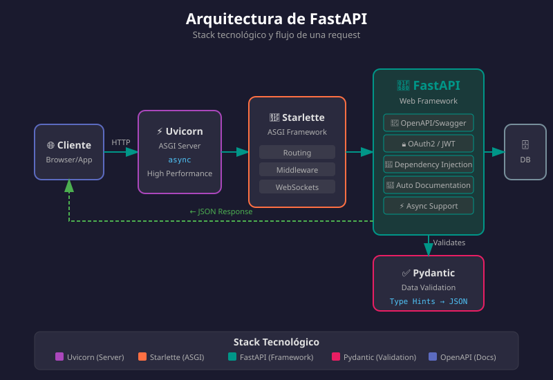

# 🚀 Introducción a FastAPI

## 🎯 Objetivos de Aprendizaje

Al finalizar este tema, serás capaz de:

- ✅ Entender qué es FastAPI y sus ventajas
- ✅ Crear tu primera aplicación FastAPI
- ✅ Comprender los decoradores de rutas
- ✅ Usar parámetros de ruta y query strings
- ✅ Acceder a la documentación automática

---

## 📚 Contenido

### 1. ¿Qué es FastAPI?

**FastAPI** es un framework web moderno y de alto rendimiento para construir APIs con Python 3.8+, basado en estándares abiertos.



#### Características Principales

| Característica | Descripción |
|----------------|-------------|
| **🚀 Alto rendimiento** | A la par con NodeJS y Go |
| **⚡ Rápido de desarrollar** | 200-300% más productivo |
| **🐛 Menos bugs** | ~40% menos errores humanos |
| **📝 Auto-documentación** | Swagger UI y ReDoc automáticos |
| **✅ Validación automática** | Con Pydantic integrado |
| **🔒 Type safety** | Basado en type hints de Python |

#### Stack Tecnológico

FastAPI está construido sobre:

- **Starlette**: Framework ASGI de alto rendimiento
- **Pydantic**: Validación de datos con type hints
- **OpenAPI**: Estándar para documentación de APIs
- **JSON Schema**: Validación de estructuras JSON

---

### 2. Tu Primera API con FastAPI

#### Paso 1: Crear el Archivo

Dentro de tu contenedor Docker, crea `main.py`:

```python
# main.py
from fastapi import FastAPI

# Crear la instancia de la aplicación
app = FastAPI(
    title="Mi Primera API",
    description="API de ejemplo para el bootcamp",
    version="1.0.0",
)

# Definir un endpoint
@app.get("/")
async def root():
    """Endpoint raíz que retorna un saludo"""
    return {"message": "¡Hola, FastAPI!"}
```

#### Paso 2: Ejecutar el Servidor

```bash
# Con Docker (recomendado)
docker compose up

# O directamente con uv
uv run fastapi dev main.py --host 0.0.0.0 --port 8000
```

#### Paso 3: Probar la API

Abre tu navegador en `http://localhost:8000`:

```json
{
    "message": "¡Hola, FastAPI!"
}
```

---

### 3. Documentación Automática

FastAPI genera documentación interactiva automáticamente:

#### Swagger UI

Accede a `http://localhost:8000/docs`:

- Interfaz interactiva para probar endpoints
- Muestra parámetros, tipos y ejemplos
- Permite ejecutar requests directamente

#### ReDoc

Accede a `http://localhost:8000/redoc`:

- Documentación en formato más legible
- Ideal para compartir con otros desarrolladores
- Genera automáticamente desde el código

> 💡 **La documentación se genera automáticamente** desde tus type hints y docstrings. ¡No necesitas escribirla manualmente!

---

### 4. Decoradores de Rutas

Los decoradores definen qué método HTTP y ruta usa cada función:

```python
from fastapi import FastAPI

app = FastAPI()

# GET - Obtener recursos
@app.get("/items")
async def list_items():
    """Lista todos los items"""
    return {"items": ["item1", "item2"]}

# POST - Crear recursos
@app.post("/items")
async def create_item():
    """Crea un nuevo item"""
    return {"message": "Item creado"}

# PUT - Actualizar recursos (completo)
@app.put("/items/{item_id}")
async def update_item(item_id: int):
    """Actualiza un item existente"""
    return {"message": f"Item {item_id} actualizado"}

# PATCH - Actualizar recursos (parcial)
@app.patch("/items/{item_id}")
async def partial_update_item(item_id: int):
    """Actualiza parcialmente un item"""
    return {"message": f"Item {item_id} parcialmente actualizado"}

# DELETE - Eliminar recursos
@app.delete("/items/{item_id}")
async def delete_item(item_id: int):
    """Elimina un item"""
    return {"message": f"Item {item_id} eliminado"}
```

#### Métodos HTTP y su Uso

| Método | Uso | Ejemplo |
|--------|-----|---------|
| `GET` | Obtener datos | Listar usuarios, ver perfil |
| `POST` | Crear nuevos recursos | Registrar usuario, crear post |
| `PUT` | Reemplazar recurso completo | Actualizar todo el perfil |
| `PATCH` | Actualizar parcialmente | Cambiar solo el email |
| `DELETE` | Eliminar recursos | Borrar cuenta, eliminar post |

---

### 5. Parámetros de Ruta (Path Parameters)

Los parámetros de ruta se definen con `{nombre}` en la URL:

```python
from fastapi import FastAPI

app = FastAPI()

# Parámetro simple
@app.get("/users/{user_id}")
async def get_user(user_id: int):
    """
    Obtiene un usuario por su ID.
    
    - **user_id**: ID único del usuario (entero)
    """
    return {"user_id": user_id, "name": f"Usuario {user_id}"}

# Múltiples parámetros
@app.get("/users/{user_id}/posts/{post_id}")
async def get_user_post(user_id: int, post_id: int):
    """Obtiene un post específico de un usuario"""
    return {
        "user_id": user_id,
        "post_id": post_id,
        "title": f"Post {post_id} del usuario {user_id}"
    }

# Parámetro string
@app.get("/items/{item_name}")
async def get_item_by_name(item_name: str):
    """Obtiene un item por su nombre"""
    return {"item_name": item_name}
```

#### Validación Automática de Tipos

FastAPI valida automáticamente los tipos:

```bash
# ✅ Válido: user_id es un entero
GET /users/123
# Respuesta: {"user_id": 123, "name": "Usuario 123"}

# ❌ Inválido: user_id no es un entero
GET /users/abc
# Respuesta 422: 
# {
#     "detail": [{
#         "loc": ["path", "user_id"],
#         "msg": "Input should be a valid integer",
#         "type": "int_parsing"
#     }]
# }
```

---

### 6. Query Parameters (Parámetros de Consulta)

Los parámetros que no están en la ruta se convierten en query parameters:

```python
from fastapi import FastAPI

app = FastAPI()

# Query parameter simple
@app.get("/items")
async def list_items(skip: int = 0, limit: int = 10):
    """
    Lista items con paginación.
    
    - **skip**: Número de items a saltar (default: 0)
    - **limit**: Máximo de items a retornar (default: 10)
    """
    return {
        "skip": skip,
        "limit": limit,
        "items": [f"Item {i}" for i in range(skip, skip + limit)]
    }

# Mezcla de path y query parameters
@app.get("/users/{user_id}/posts")
async def get_user_posts(
    user_id: int,           # Path parameter (obligatorio)
    published: bool = True,  # Query parameter con default
    tags: str | None = None, # Query parameter opcional
):
    """Obtiene los posts de un usuario con filtros"""
    return {
        "user_id": user_id,
        "published": published,
        "tags": tags,
    }
```

#### Ejemplos de URLs

```bash
# Solo path parameter
GET /users/123/posts
# {"user_id": 123, "published": true, "tags": null}

# Con query parameters
GET /users/123/posts?published=false
# {"user_id": 123, "published": false, "tags": null}

# Múltiples query parameters
GET /users/123/posts?published=true&tags=python
# {"user_id": 123, "published": true, "tags": "python"}
```

---

### 7. Parámetros Obligatorios vs Opcionales

```python
from fastapi import FastAPI

app = FastAPI()

@app.get("/search")
async def search(
    q: str,                    # Obligatorio (sin valor por defecto)
    page: int = 1,             # Opcional con default
    per_page: int = 20,        # Opcional con default
    sort: str | None = None,   # Opcional, puede ser None
):
    """
    Busca items en la base de datos.
    
    - **q**: Término de búsqueda (obligatorio)
    - **page**: Número de página (default: 1)
    - **per_page**: Resultados por página (default: 20)
    - **sort**: Campo para ordenar (opcional)
    """
    return {
        "query": q,
        "page": page,
        "per_page": per_page,
        "sort": sort,
    }
```

```bash
# ❌ Error: falta el parámetro obligatorio 'q'
GET /search
# 422 Unprocessable Entity

# ✅ Válido: 'q' proporcionado
GET /search?q=fastapi
# {"query": "fastapi", "page": 1, "per_page": 20, "sort": null}

# ✅ Válido: con parámetros opcionales
GET /search?q=fastapi&page=2&sort=date
# {"query": "fastapi", "page": 2, "per_page": 20, "sort": "date"}
```

---

### 8. Estructura Completa de Ejemplo

```python
# main.py
from fastapi import FastAPI

# Configuración de la aplicación
app = FastAPI(
    title="Bootcamp API",
    description="API de ejemplo para el Bootcamp FastAPI",
    version="1.0.0",
    docs_url="/docs",      # URL de Swagger (default)
    redoc_url="/redoc",    # URL de ReDoc (default)
)

# Base de datos simulada
fake_db = {
    "users": [
        {"id": 1, "name": "Alice", "email": "alice@example.com"},
        {"id": 2, "name": "Bob", "email": "bob@example.com"},
        {"id": 3, "name": "Charlie", "email": "charlie@example.com"},
    ]
}


# ============================================
# ENDPOINTS
# ============================================

@app.get("/")
async def root():
    """Endpoint raíz con información de la API"""
    return {
        "name": "Bootcamp API",
        "version": "1.0.0",
        "docs": "/docs",
    }


@app.get("/health")
async def health_check():
    """Verifica que la API está funcionando"""
    return {"status": "healthy"}


@app.get("/users")
async def list_users(skip: int = 0, limit: int = 10):
    """
    Lista todos los usuarios con paginación.
    
    - **skip**: Usuarios a saltar
    - **limit**: Máximo de usuarios a retornar
    """
    users = fake_db["users"][skip : skip + limit]
    return {
        "total": len(fake_db["users"]),
        "skip": skip,
        "limit": limit,
        "users": users,
    }


@app.get("/users/{user_id}")
async def get_user(user_id: int):
    """
    Obtiene un usuario por su ID.
    
    - **user_id**: ID único del usuario
    """
    for user in fake_db["users"]:
        if user["id"] == user_id:
            return user
    return {"error": "Usuario no encontrado"}


@app.get("/search/users")
async def search_users(
    q: str,
    field: str = "name",
):
    """
    Busca usuarios por nombre o email.
    
    - **q**: Término de búsqueda
    - **field**: Campo donde buscar (name o email)
    """
    results = [
        user for user in fake_db["users"]
        if q.lower() in user.get(field, "").lower()
    ]
    return {
        "query": q,
        "field": field,
        "count": len(results),
        "results": results,
    }
```

---

### 9. Ejecutando con Docker

#### docker-compose.yml

```yaml
services:
  api:
    build: .
    ports:
      - "8000:8000"
    volumes:
      - .:/app
    environment:
      - PYTHONDONTWRITEBYTECODE=1
      - PYTHONUNBUFFERED=1
```

#### Dockerfile

```dockerfile
FROM python:3.13-slim

ENV PYTHONDONTWRITEBYTECODE=1 \
    PYTHONUNBUFFERED=1 \
    UV_SYSTEM_PYTHON=1

RUN pip install --no-cache-dir uv

WORKDIR /app
COPY pyproject.toml uv.lock* ./
RUN uv sync --frozen --no-dev

COPY . .

EXPOSE 8000
CMD ["uv", "run", "fastapi", "dev", "main.py", "--host", "0.0.0.0"]
```

#### Comandos

```bash
# Construir y ejecutar
docker compose up --build

# Ver logs
docker compose logs -f api

# Detener
docker compose down
```

---

## 📝 Resumen

| Concepto | Descripción |
|----------|-------------|
| `FastAPI()` | Crea la instancia de la aplicación |
| `@app.get("/ruta")` | Define un endpoint GET |
| `{param}` | Parámetro de ruta (en la URL) |
| `param: type = default` | Query parameter opcional |
| `param: type` | Query parameter obligatorio |
| `/docs` | Documentación Swagger UI |
| `/redoc` | Documentación ReDoc |

---

## ✅ Checklist de Verificación

Antes de continuar, asegúrate de poder:

- [ ] Crear una aplicación FastAPI básica
- [ ] Definir endpoints con diferentes métodos HTTP
- [ ] Usar parámetros de ruta (`/users/{user_id}`)
- [ ] Usar query parameters (`?page=1&limit=10`)
- [ ] Acceder a la documentación en `/docs`
- [ ] Ejecutar la API con Docker

---

## 🔗 Recursos Adicionales

- [FastAPI Documentation](https://fastapi.tiangolo.com/)
- [FastAPI Tutorial](https://fastapi.tiangolo.com/tutorial/)
- [Starlette](https://www.starlette.io/)

---

[← Anterior: Async/Await](04-async-await.md) | [Siguiente: Prácticas →](../2-practicas/README.md)
