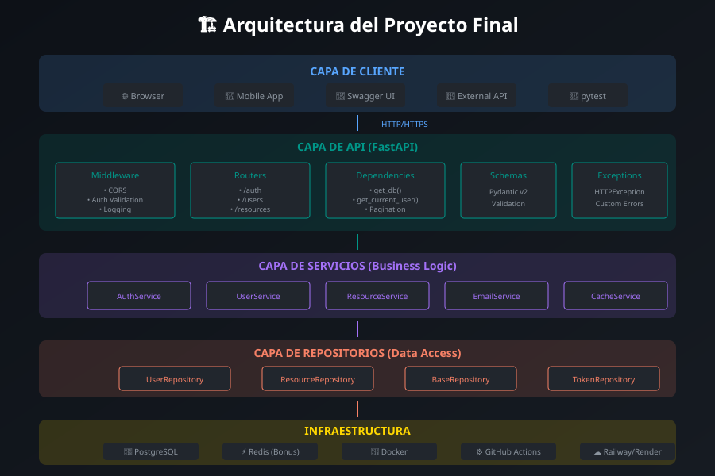

# 🎯 Guía del Proyecto Final



## 📋 Descripción

El proyecto final es tu oportunidad de demostrar todo lo aprendido durante el bootcamp. Construirás una **API completa y lista para producción** que servirá como pieza central de tu portfolio.

---

## 🎯 Objetivos

1. Aplicar arquitectura limpia y patrones de diseño
2. Implementar autenticación y autorización robusta
3. Escribir código testeable y bien documentado
4. Desplegar en un entorno de producción real
5. Presentar tu trabajo de forma profesional

---

## 📊 Opciones de Proyecto

Elige **UNA** de las siguientes opciones:

### Opción A: Task Management API (Recomendada)

Sistema de gestión de tareas estilo Todoist/Trello.

**Entidades:**
- Users (autenticación)
- Projects (proyectos)
- Tasks (tareas)
- Labels (etiquetas)
- Comments (comentarios)

**Features:**
- CRUD completo de todas las entidades
- Autenticación JWT + refresh tokens
- Roles: admin, user
- Asignación de tareas a usuarios
- Filtros y búsqueda
- Paginación

### Opción B: E-commerce API

API para tienda online básica.

**Entidades:**
- Users (clientes y admins)
- Products (productos)
- Categories (categorías)
- Orders (pedidos)
- OrderItems (items del pedido)

**Features:**
- Catálogo de productos con categorías
- Carrito de compras
- Proceso de checkout
- Historial de pedidos
- Gestión de inventario

### Opción C: Blog API

Plataforma de blogging con autores y posts.

**Entidades:**
- Users (autores)
- Posts (artículos)
- Categories (categorías)
- Tags (etiquetas)
- Comments (comentarios)

**Features:**
- CRUD de posts con markdown
- Sistema de comentarios
- Likes/favoritos
- Búsqueda de posts
- Feed personalizado

### Opción D: Proyecto Propio

Propón tu propio proyecto (debe aprobarse).

**Requisitos mínimos:**
- Al menos 4 entidades relacionadas
- Autenticación completa
- Complejidad similar a las opciones anteriores

---

## 🏗️ Arquitectura Requerida

```
src/
├── main.py                 # Entry point
├── config.py               # Settings
├── database.py             # DB connection
│
├── models/                 # SQLAlchemy models
│   ├── __init__.py
│   ├── user.py
│   └── ...
│
├── schemas/                # Pydantic schemas
│   ├── __init__.py
│   ├── user.py
│   └── ...
│
├── repositories/           # Data access layer
│   ├── __init__.py
│   ├── base.py
│   └── user_repository.py
│
├── services/               # Business logic
│   ├── __init__.py
│   ├── user_service.py
│   └── auth_service.py
│
├── routers/                # API endpoints
│   ├── __init__.py
│   ├── users.py
│   ├── auth.py
│   └── ...
│
├── dependencies/           # FastAPI dependencies
│   ├── __init__.py
│   ├── auth.py
│   └── database.py
│
├── exceptions/             # Custom exceptions
│   ├── __init__.py
│   └── http_exceptions.py
│
└── utils/                  # Utilities
    ├── __init__.py
    └── security.py
```

---

## ✅ Checklist de Requisitos

### Obligatorios (para aprobar)

#### Backend
- [ ] FastAPI con Python 3.12+
- [ ] SQLAlchemy 2.x con PostgreSQL
- [ ] Pydantic v2 para validación
- [ ] Autenticación JWT
- [ ] CRUD completo de entidades principales
- [ ] Manejo de errores consistente
- [ ] Paginación en endpoints de listado

#### Testing
- [ ] pytest con cobertura > 50%
- [ ] Tests de endpoints principales
- [ ] Fixtures para datos de prueba

#### DevOps
- [ ] Dockerfile multi-stage
- [ ] docker-compose.yml funcional
- [ ] GitHub Actions (lint + test)
- [ ] Deployment público

#### Documentación
- [ ] README completo
- [ ] OpenAPI/Swagger configurado
- [ ] Instrucciones de instalación

### Opcionales (bonus)

- [ ] Refresh tokens
- [ ] Rate limiting
- [ ] Cache con Redis
- [ ] WebSockets
- [ ] Frontend básico
- [ ] Métricas/Monitoreo
- [ ] Logs estructurados

---

## 📋 Endpoints Mínimos

### Autenticación
```
POST   /api/v1/auth/register
POST   /api/v1/auth/login
POST   /api/v1/auth/refresh
POST   /api/v1/auth/logout
GET    /api/v1/auth/me
```

### Users (admin)
```
GET    /api/v1/users
GET    /api/v1/users/{id}
PUT    /api/v1/users/{id}
DELETE /api/v1/users/{id}
```

### Recursos principales (ejemplo: Tasks)
```
GET    /api/v1/tasks
POST   /api/v1/tasks
GET    /api/v1/tasks/{id}
PUT    /api/v1/tasks/{id}
DELETE /api/v1/tasks/{id}
```

### Health
```
GET    /health
GET    /health/ready
```

---

## 📝 Esquema de Base de Datos (Ejemplo)

```sql
-- Users
CREATE TABLE users (
    id SERIAL PRIMARY KEY,
    email VARCHAR(255) UNIQUE NOT NULL,
    hashed_password VARCHAR(255) NOT NULL,
    full_name VARCHAR(100),
    is_active BOOLEAN DEFAULT TRUE,
    is_admin BOOLEAN DEFAULT FALSE,
    created_at TIMESTAMP DEFAULT NOW(),
    updated_at TIMESTAMP DEFAULT NOW()
);

-- Projects
CREATE TABLE projects (
    id SERIAL PRIMARY KEY,
    name VARCHAR(200) NOT NULL,
    description TEXT,
    owner_id INTEGER REFERENCES users(id),
    created_at TIMESTAMP DEFAULT NOW(),
    updated_at TIMESTAMP DEFAULT NOW()
);

-- Tasks
CREATE TABLE tasks (
    id SERIAL PRIMARY KEY,
    title VARCHAR(200) NOT NULL,
    description TEXT,
    completed BOOLEAN DEFAULT FALSE,
    priority VARCHAR(20) DEFAULT 'medium',
    due_date TIMESTAMP,
    project_id INTEGER REFERENCES projects(id),
    assignee_id INTEGER REFERENCES users(id),
    created_at TIMESTAMP DEFAULT NOW(),
    updated_at TIMESTAMP DEFAULT NOW()
);
```

---

## 🚀 Pasos Recomendados

### Día 1-2: Setup y Modelos
1. Configurar proyecto (Docker, estructura)
2. Definir modelos de datos
3. Configurar migraciones (Alembic)
4. Crear schemas Pydantic

### Día 3-4: Core Features
1. Implementar autenticación
2. CRUD de entidades principales
3. Relaciones entre entidades
4. Validaciones y errores

### Día 5: Testing y Calidad
1. Escribir tests
2. Code review propio
3. Linting y type hints
4. Documentación de código

### Día 6: DevOps
1. Optimizar Dockerfile
2. Configurar CI/CD completo
3. Desplegar a producción
4. Probar en producción

### Día 7: Presentación
1. Preparar demo
2. Documentar decisiones técnicas
3. Ensayar presentación
4. README final

---

## 📚 Recursos de Apoyo

- [Semana 7: SQLAlchemy y Repositorios](../week-07-repository_pattern/)
- [Semana 8: Services y Arquitectura](../week-08-arquitectura_en_capas_completa/)
- [Semana 11: Autenticación JWT](../week-11-autenticacion_jwt_y_oauth2/)
- [Semana 13: Testing](../week-13-websockets_y_server_sent_events/)
- [Semana 15: Docker y CI/CD](../week-15-docker_cicd_produccion/)

---

## 💡 Tips para el Éxito

1. **Empieza simple**: Primero hazlo funcionar, luego mejóralo
2. **Commits frecuentes**: Guarda tu progreso regularmente
3. **Prueba localmente**: Antes de desplegar, prueba con Docker
4. **Pide feedback**: Comparte tu progreso con compañeros
5. **Documenta mientras codeas**: No lo dejes para el final

---

## ❓ Preguntas Frecuentes

**¿Puedo usar un frontend framework?**
Sí, pero el foco debe ser el backend. El frontend es bonus.

**¿Qué plataforma de deployment usar?**
Railway, Render o Fly.io son recomendados. Todos tienen tier gratuito.

**¿Puedo trabajar en equipo?**
El proyecto final es individual para la evaluación.

**¿Cuánto tiempo tengo?**
Una semana completa (~7 horas de trabajo efectivo).
