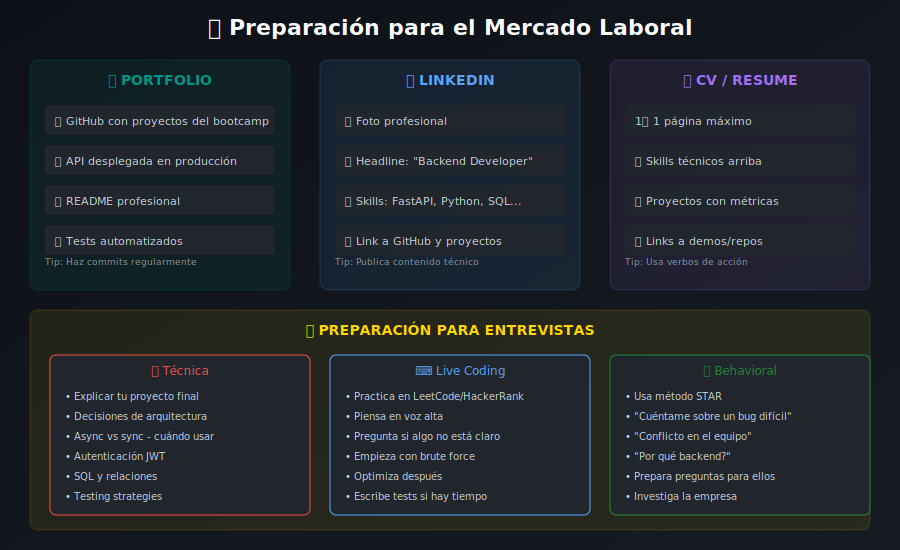

# 💼 Preparación Laboral para Backend Developers



## 📋 Descripción

Esta guía te ayudará a prepararte para el mercado laboral como desarrollador backend junior especializado en FastAPI y Python.

---

## 🎯 Objetivos

1. Construir un portfolio profesional
2. Optimizar tu presencia en LinkedIn y GitHub
3. Prepararte para entrevistas técnicas
4. Conocer el mercado laboral backend

---

## 📂 Portfolio de Proyectos

### Proyecto Principal: Tu API Final

Tu proyecto del bootcamp es tu carta de presentación.

**Checklist del proyecto perfecto:**
- [ ] Código limpio y bien estructurado
- [ ] README profesional con badges
- [ ] Tests con buena cobertura
- [ ] Deploy público funcional
- [ ] Documentación OpenAPI completa
- [ ] CI/CD configurado
- [ ] Sin credenciales expuestas

### Proyectos Complementarios

Además del proyecto final, considera tener 2-3 proyectos más:

#### 1. CLI Tool (Python)
```python
# Ejemplo: Task manager CLI con Typer
import typer
from rich.console import Console
from rich.table import Table

app = typer.Typer()
console = Console()

@app.command()
def add(task: str, priority: str = "medium"):
    """Agrega una nueva tarea."""
    # Implementación
    console.print(f"✅ Tarea agregada: {task}")

@app.command()
def list():
    """Lista todas las tareas."""
    table = Table(title="Mis Tareas")
    table.add_column("ID", style="cyan")
    table.add_column("Tarea", style="green")
    table.add_column("Prioridad", style="yellow")
    # Agregar filas
    console.print(table)

if __name__ == "__main__":
    app()
```

#### 2. Integración con API Externa
```python
# Ejemplo: Bot de Discord/Telegram o integración con servicio
import httpx
from fastapi import FastAPI

app = FastAPI()

@app.get("/weather/{city}")
async def get_weather(city: str):
    async with httpx.AsyncClient() as client:
        response = await client.get(
            f"https://api.openweathermap.org/data/2.5/weather",
            params={"q": city, "appid": settings.api_key}
        )
        return response.json()
```

#### 3. Contribución Open Source
- Busca issues con label "good first issue"
- FastAPI, Pydantic, SQLAlchemy tienen comunidades activas
- Documentación también cuenta como contribución

---

## 🔗 Optimización de GitHub

### Perfil Profesional

```markdown
# Tu perfil README.md (github.com/tuuser)

## 👋 Hola, soy [Tu Nombre]

Backend Developer especializado en Python y FastAPI.

### 🛠️ Stack Principal


### 📊 GitHub Stats


### 🔥 Proyectos Destacados
- [Task API](https://github.com/tuuser/task-api) - API de gestión de tareas
- [Weather CLI](https://github.com/tuuser/weather-cli) - CLI para clima

### 📫 Contacto
- LinkedIn: [tunombre](https://linkedin.com/in/tunombre)
- Email: tu@email.com
```

### Mejores Prácticas

- ✅ Commits descriptivos y frecuentes
- ✅ Branches con nombres claros (`feature/auth`, `fix/login-bug`)
- ✅ Pull Requests bien documentados
- ✅ Issues organizados con labels
- ✅ Proyectos con licencia clara

---

## 💼 LinkedIn para Developers

### Titular Optimizado

```
Backend Developer | Python | FastAPI | PostgreSQL | Docker
```

o

```
Junior Backend Developer especializado en APIs RESTful con Python/FastAPI
```

### Sección "Acerca de"

```
🚀 Backend Developer con experiencia en desarrollo de APIs RESTful 
   usando Python y FastAPI.

💻 Stack principal:
   • Python 3.12+ con type hints
   • FastAPI para APIs de alto rendimiento
   • SQLAlchemy + PostgreSQL
   • Docker y CI/CD con GitHub Actions
   • Testing con pytest

📚 Recientemente completé un bootcamp intensivo de FastAPI donde 
   desarrollé [nombre del proyecto] - una API completa con 
   autenticación JWT, arquitectura limpia y deployment en producción.

🎯 Busco oportunidades como Backend Developer donde pueda 
   contribuir y seguir creciendo en el desarrollo de APIs escalables.

📫 Abierto a conversaciones: tu@email.com
```

### Proyectos en LinkedIn

Agrega tu proyecto final como "Proyecto" en LinkedIn:

- Título: Task Management API
- Descripción: API RESTful para gestión de tareas...
- URL: Link al repositorio y demo
- Tecnologías: Python, FastAPI, PostgreSQL, Docker

---

## 🎤 Preparación para Entrevistas

### Preguntas Técnicas Comunes

#### Python Básico
```python
# 1. ¿Diferencia entre list y tuple?
# Lista: mutable, []
# Tupla: inmutable, ()

# 2. ¿Qué son *args y **kwargs?
def example(*args, **kwargs):
    print(args)    # Tupla de argumentos posicionales
    print(kwargs)  # Dict de argumentos con nombre

# 3. List comprehension vs generator
squares_list = [x**2 for x in range(1000)]  # Memoria inmediata
squares_gen = (x**2 for x in range(1000))   # Lazy evaluation

# 4. Decoradores
def timer(func):
    def wrapper(*args, **kwargs):
        start = time.time()
        result = func(*args, **kwargs)
        print(f"Tiempo: {time.time() - start}s")
        return result
    return wrapper

# 5. Context managers
with open("file.txt") as f:  # __enter__ y __exit__
    content = f.read()
```

#### FastAPI Específico
```python
# 1. ¿Por qué FastAPI es rápido?
# - Basado en Starlette (ASGI, async)
# - Pydantic para validación (compilado con Rust en v2)
# - Type hints para optimización

# 2. ¿Diferencia entre Depends y middleware?
# Depends: Por endpoint, inyección de dependencias
# Middleware: Global, cada request

# 3. ¿Cómo manejas autenticación?
from fastapi import Depends, HTTPException
from fastapi.security import OAuth2PasswordBearer

oauth2_scheme = OAuth2PasswordBearer(tokenUrl="token")

async def get_current_user(token: str = Depends(oauth2_scheme)):
    user = decode_token(token)
    if not user:
        raise HTTPException(status_code=401)
    return user

# 4. ¿Cómo implementas paginación?
@router.get("/items")
async def list_items(skip: int = 0, limit: int = 20):
    return await db.query(Item).offset(skip).limit(limit).all()

# 5. Background tasks
from fastapi import BackgroundTasks

@router.post("/send-email")
async def send_email(
    email: str,
    background_tasks: BackgroundTasks
):
    background_tasks.add_task(send_email_async, email)
    return {"message": "Email enviado en background"}
```

#### SQL y Bases de Datos
```sql
-- 1. JOINs
SELECT u.name, COUNT(t.id) as task_count
FROM users u
LEFT JOIN tasks t ON u.id = t.user_id
GROUP BY u.id;

-- 2. Índices
CREATE INDEX idx_tasks_user_id ON tasks(user_id);
CREATE INDEX idx_tasks_status ON tasks(status);

-- 3. Transacciones
BEGIN;
UPDATE accounts SET balance = balance - 100 WHERE id = 1;
UPDATE accounts SET balance = balance + 100 WHERE id = 2;
COMMIT;
```

### Preguntas de Arquitectura

1. **¿Cómo estructuras un proyecto FastAPI?**
   - Menciona la separación en capas: routers, services, repositories
   - Explica la inversión de dependencias
   - Habla de la testabilidad

2. **¿Cómo manejas errores?**
   - Exception handlers globales
   - Excepciones personalizadas
   - Logging estructurado

3. **¿Cómo aseguras la calidad del código?**
   - Tests unitarios y de integración
   - Linting (Ruff)
   - Type checking
   - Code reviews

### Preguntas de Comportamiento (STAR Method)

**Situación → Tarea → Acción → Resultado**

Ejemplo: "Cuéntame sobre un bug difícil que resolviste"

```
Situación: En mi proyecto final, los usuarios reportaban 
           que sus sesiones expiraban inesperadamente.

Tarea: Encontrar la causa y solucionar el problema 
       sin afectar usuarios activos.

Acción: 
1. Agregué logging detallado en el flujo de auth
2. Descubrí que el refresh token no se actualizaba correctamente
3. Implementé un fix con tests de regresión
4. Desplegué gradualmente con feature flags

Resultado: El bug se resolvió sin downtime y agregué 
           monitoreo para detectar issues similares.
```

---

## 💰 Expectativas Salariales (Referencia)

### Latinoamérica (USD/año - remoto)
| Nivel | Rango |
|-------|-------|
| Junior (0-2 años) | $15,000 - $30,000 |
| Mid (2-4 años) | $30,000 - $50,000 |
| Senior (4+ años) | $50,000 - $80,000+ |

### España (EUR/año)
| Nivel | Rango |
|-------|-------|
| Junior | €22,000 - €30,000 |
| Mid | €30,000 - €45,000 |
| Senior | €45,000 - €65,000+ |

*Nota: Varían por ciudad, empresa y habilidades específicas.*

---

## 🔍 Dónde Buscar Trabajo

### Plataformas Recomendadas

- **LinkedIn Jobs**: Networking + ofertas
- **Wellfound (AngelList)**: Startups
- **Remote OK**: Trabajo remoto
- **We Work Remotely**: Remoto internacional
- **GetonBoard**: Latam
- **InfoJobs/Indeed**: España
- **Glassdoor**: Reviews + ofertas

### Keywords para Buscar

```
"Backend Developer" + Python
"Python Developer" + FastAPI
"API Developer" + Python
"Backend Engineer" + junior
"Software Developer" + Python + remote
```

---

## ✅ Checklist Pre-Búsqueda

- [ ] CV actualizado (1 página)
- [ ] LinkedIn optimizado
- [ ] GitHub con proyectos públicos
- [ ] Portfolio/website personal (opcional pero recomendado)
- [ ] Proyecto final desplegado y funcionando
- [ ] Practicar problemas de coding (LeetCode básico)
- [ ] Preparar respuestas STAR
- [ ] Lista de empresas objetivo

---

## 📚 Recursos Adicionales

- [Tech Interview Handbook](https://www.techinterviewhandbook.org/)
- [System Design Primer](https://github.com/donnemartin/system-design-primer)
- [Python Interview Questions](https://github.com/zhiwehu/Python-programming-exercises)
- [Roadmap.sh - Backend Developer](https://roadmap.sh/backend)
